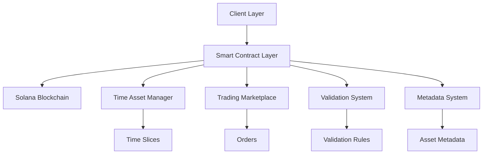
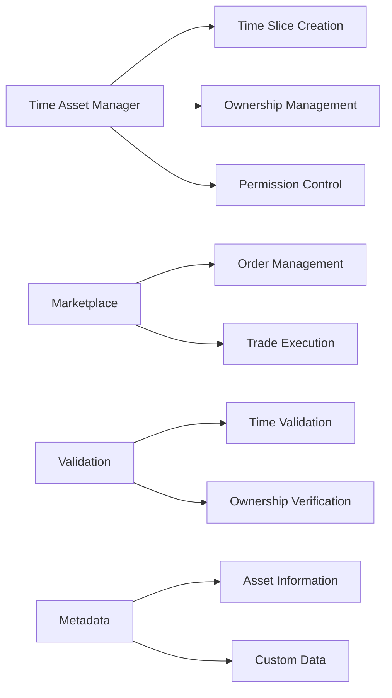
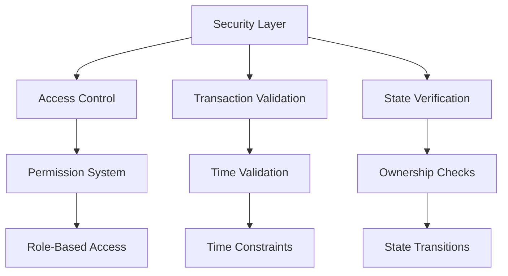
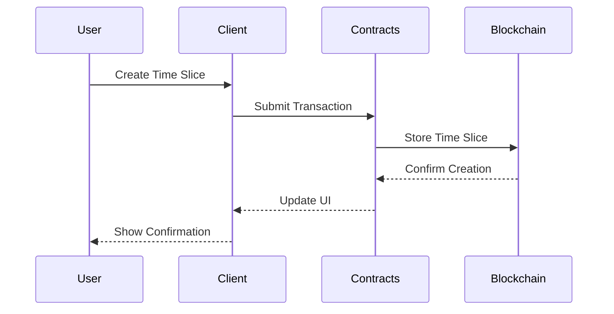
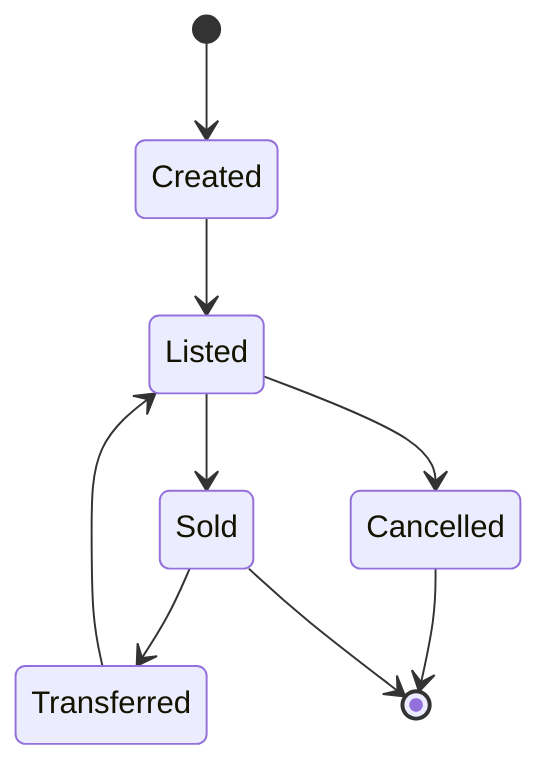

# S-Time: Solana Time Resource Trading Protocol


## Overview

S-Time is a revolutionary protocol that tokenizes time on the Solana blockchain, enabling the trading and management of time as a digital asset. By leveraging Solana's high-performance infrastructure, S-Time creates a new paradigm for time-based resource allocation and trading.

## Vision and Mission

Our vision is to create a decentralized time economy where every moment can be valued, traded, and utilized efficiently. We aim to:
- Democratize access to time-based resources
- Create new economic models for time valuation
- Enable innovative use cases in DeFi and Web3
- Build a sustainable ecosystem for time trading

## Technical Architecture

### System Architecture



### Smart Contract Architecture



### Security Architecture



## Implementation Details

### Core Components

1. **Time Asset Manager**
   - Time slice creation and management
   - Ownership and permission control
   - Transfer and trading functionality
   - Rarity and value calculation
   - Time slice fragmentation and merging

2. **Trading Marketplace**
   - Order creation and management
   - Price discovery mechanisms
   - Trade execution and settlement
   - Auction system implementation
   - Order matching engine
   - Price oracle integration

3. **Validation System**
   - Time slice validation
   - Ownership verification
   - Availability checking
   - Cross-chain validation
   - State consistency checks
   - Time synchronization

4. **Metadata System**
   - Asset information management
   - Custom data storage
   - Version control
   - IPFS integration
   - Metadata standards compliance
   - Search and indexing

### Data Flow



### State Management



## Project Structure

```
S-Time/
├── programs/                 # Solana smart contracts
│   └── s-time/
│       ├── src/
│       │   ├── instructions/ # Program instructions
│       │   ├── state/       # Program state definitions
│       │   ├── errors/      # Custom error types
│       │   └── constants/   # Program constants
│       └── tests/           # Program tests
├── src/                     # Client-side application
│   ├── api/                # API integration
│   ├── components/         # React components
│   ├── hooks/             # Custom React hooks
│   ├── store/             # State management
│   ├── styles/            # Global styles
│   ├── types/             # TypeScript types
│   ├── utils/             # Utility functions
│   ├── services/          # Business logic services
│   └── config/            # Configuration files
├── tests/                  # Test suites
│   ├── unit/              # Unit tests
│   ├── integration/       # Integration tests
│   └── e2e/              # End-to-end tests
├── docs/                   # Documentation
│   ├── api/               # API documentation
│   ├── architecture/      # Architecture documentation
│   ├── guides/            # User guides
│   └── examples/          # Code examples
├── assets/                # Static assets
│   └── images/           # Image assets
└── scripts/               # Build and deployment scripts
```

## Key Features

- **Time Tokenization**: Convert time into unique digital assets
- **Precise Control**: Millisecond-level time slice management
- **Multi-dimensional Value**: Combine speculative, utility, and collectible aspects
- **Ecosystem Integration**: Support for DeFi, GameFi, NFT, and metaverse applications
- **Advanced Trading**: Multiple order types and auction mechanisms
- **Security First**: Comprehensive validation and verification systems
- **Scalable Architecture**: Built on Solana's high-performance infrastructure
- **Developer Friendly**: Extensive documentation and SDK support

## Technical Implementation

### Smart Contract Integration

```typescript
// Time Slice Creation
const createTimeSlice = async (
    startTime: number,
    endTime: number,
    metadata: string
) => {
    const timeSlice = await program.methods
        .createTimeSlice(startTime, endTime, metadata)
        .accounts({
            timeSlice: timeSlicePDA,
            owner: wallet.publicKey,
            systemProgram: SystemProgram.programId,
        })
        .rpc();
    return timeSlice;
};

// Order Creation
const createOrder = async (
    timeSliceId: string,
    price: number,
    orderType: number
) => {
    const order = await program.methods
        .createOrder(timeSliceId, price, orderType)
        .accounts({
            order: orderPDA,
            seller: wallet.publicKey,
            systemProgram: SystemProgram.programId,
        })
        .rpc();
    return order;
};
```

### Advanced Features

1. **Time Slice Management**
   ```typescript
   // Time slice fragmentation
   const fragmentTimeSlice = async (
       timeSliceId: string,
       fragments: number
   ) => {
       // Implementation details
   };

   // Time slice merging
   const mergeTimeSlices = async (
       timeSliceIds: string[]
   ) => {
       // Implementation details
   };
   ```

2. **Marketplace Operations**
   ```typescript
   // Auction creation
   const createAuction = async (
       timeSliceId: string,
       startPrice: number,
       duration: number
   ) => {
       // Implementation details
   };

   // Dutch auction
   const createDutchAuction = async (
       timeSliceId: string,
       startPrice: number,
       endPrice: number,
       duration: number
   ) => {
       // Implementation details
   };
   ```

## Getting Started

### Prerequisites

- Solana CLI tools
- Rust programming language
- Node.js and npm
- Git

### Installation

1. Clone the repository:
```bash
git clone https://github.com/STimesolt/S-Time.git
cd S-Time
```

2. Install dependencies:
```bash
npm install
```

3. Build the project:
```bash
npm run build
```

## Development

### Running Tests
```bash
npm test
```

### Building Contracts
```bash
npm run build:contracts
```

### Development Workflow

1. **Local Development**
   ```bash
   npm run dev
   ```

2. **Testing**
   ```bash
   npm run test:unit
   npm run test:integration
   npm run test:e2e
   ```

3. **Linting and Formatting**
   ```bash
   npm run lint
   npm run format
   ```

## Security

- Smart contract audits
- Formal verification
- Security best practices
- Regular security updates
- Bug bounty program

## Performance

- Optimized smart contracts
- Efficient state management
- Minimal gas consumption
- Fast transaction processing
- Scalable architecture

## Contributing

Please read [CONTRIBUTING.md](CONTRIBUTING.md) for details on our code of conduct and the process for submitting pull requests.

## License

This project is licensed under the MIT License - see the [LICENSE](LICENSE) file for details.

## Contact & Community

### Official Channels
- Website: [stimestm.xyz](https://stimestm.xyz)
- Twitter: [@S_Time_STM](https://x.com/S_Time_STM)
- GitHub: [STimesolt/S-Time](https://github.com/STimesolt/S-Time)

### Stay Connected
- Follow our Twitter for updates: [@S_Time_STM](https://x.com/S_Time_STM)
- Visit our website for documentation: [stimestm.xyz](https://stimestm.xyz)
- Contribute to our open-source project: [STimesolt/S-Time](https://github.com/STimesolt/S-Time) 